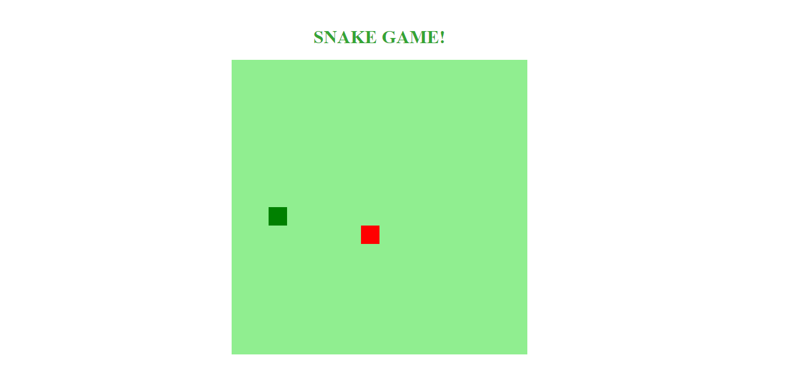

<h1 align="center" style="text-transform: uppercase">Jogo da Cobrinha</h1>

<h3 align="center">Clone do Jogo da Cobrinha desenvolvido no Bootcamp Front-End da DIO.</h3>

 

  

    

Acesse o projeto [aqui](https://fel1324.github.io/Jogo-da-Cobrinha/)

 

## 🔥 Tecnologias

* HTML e CSS
* Javascript
* Git e Github

 

## 🖥️ Projeto

O projeto é um game simples inspirado no clássico Jogo da Cobrinha, funciona do mesmo modo que o jogo original.

 

## 🧾 Licença

Esse projeto está sob a licença MIT.
